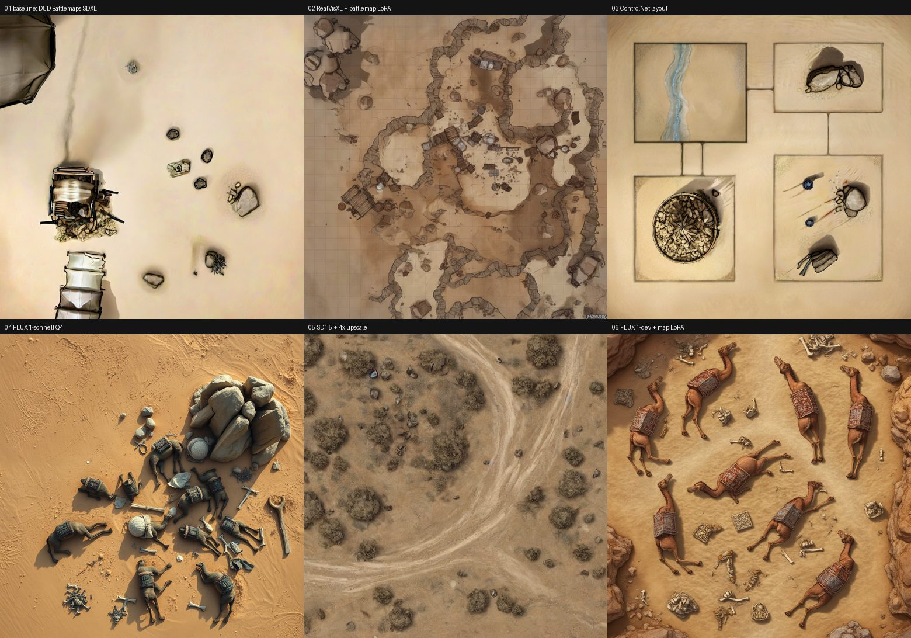

# Battlemap models compared (2026-09-17)

Six graphs in `workflows/battlemap/`, all run on the same machine (M1 Max,
64 GB, MPS), the same prompt and the same seed (424242), 1024x1024:

> a sacked desert caravan camp on open sand, dead camels, torn cargo bundles,
> scattered bones, rocky outcrops

| # | Graph | Model(s) | Time | What came out |
| - | ----- | -------- | ---- | ------------- |
| 01 | baseline | D&D Battlemaps SDXL 1.0, 8 steps cfg 2.5 | **40 s** | Mostly empty sand with a few props. The same weakness the caravan brief hit in play: at 8 steps it settles layout, not content |
| 02 | modular | RealVisXL V5.0 + `sdxl-battlemaps-v1` LoRA, 25 steps cfg 5 | 80 s | The most battlemap-like terrain of the six: rock shelves, debris, readable ground. **Draws a square grid**, which we do not want -- add `grid` to the negative or lower LoRA strength |
| 03 | controlnet | D&D Battlemaps SDXL + ControlNet union promax, canny from a floor plan | 65 s | Held the layout exactly: four chambers, corridor, the round cave. Interior detail is thin at 12 steps, but the architecture came from the plan, not from luck |
| 04 | flux | FLUX.1-schnell Q4_K_S, 4 steps | 105 s | Best prompt adherence for the money: camels, bones, cargo, boulders, all top-down. Slight 3D-render look and long shadows |
| 05 | sd15 | DnD Map Generator v3 + 4x NMKD upscale, 25 steps | **50 s** | Generic desert scrub; ignored the caravan entirely. Fast, but needs its own prompt vocabulary |
| 06 | flux + lora | FLUX.1-dev Q8 + `flux-dnd-map-world` LoRA, 20 steps | 405 s | Richest and most legible scene: saddled camels, scattered bones, rock edges. Nearly 7 minutes per image, and dev's licence is non-commercial |

## What this says

- **The baseline is the weakest content generator of the six** and the
  fastest. It is fine for terrain-only maps (Emberhollow Gulch) and poor at
  "a scene with specific things in it" (the caravan).
- **Flux is the answer for prompt adherence.** schnell at 105 s is the
  practical option; dev + LoRA is better still but 4x slower and
  non-commercial.
- **ControlNet is the answer for layout.** Nothing else here puts rooms and
  corridors where you asked. Pair it with a Dungeon Scrawl export.
- **The SDXL battlemap LoRA is the answer for looks**, if the drawn grid is
  suppressed -- worth one experiment at strength 0.6-0.7 with `grid` in the
  negative prompt.
- Timings are first-run including model load; a second render with the same
  model is faster.

## Suggested next step

Do not swap the tool's default yet. `generate-map` exposes no quality knob
(#4) and has no design record (#8). The cheap, reversible experiment is to
add a `workflow` parameter that selects one of these graphs by name, keeping
01 as the default; then a GM can ask for "the flux one" when a map needs
specific contents. That decision belongs with #8.

## Models on disk

Installed under `~/workplace/OSS/comfyui/models/`:

| File | Size | Source | Licence |
| ---- | ---- | ------ | ------- |
| `checkpoints/dDBattlemapsSDXL10_upscaleV10.safetensors` | 6.9 GB | HF `AdamDooley/dnd-battlemaps-sdxl-1.0-mirror` | OpenRAIL++-M + no image sales |
| `checkpoints/realvisxl_v50_fp16.safetensors` | 6.9 GB | HF `SG161222/RealVisXL_V5.0` | OpenRAIL++-M |
| `checkpoints/dreamshaperXL_turbo_v21.safetensors` | 6.9 GB | HF `Lykon/dreamshaper-xl-v2-turbo` | OpenRAIL++-M |
| `checkpoints/dndMapGenerator_v3_sd15.safetensors` | 2.2 GB | Civitai 5012 v3 | Civitai terms |
| `diffusion_models/flux1-schnell-Q4_K_S.gguf` | 6.3 GB | HF `city96/FLUX.1-schnell-gguf` | Apache-2.0 |
| `diffusion_models/flux1-dev-Q8_0.gguf` | 12.6 GB | already installed | FLUX.1-dev non-commercial |
| `loras/sdxl-battlemaps-v1.safetensors` | 1.7 GB | Civitai 613017 v1.0, trigger `battlemap` | Civitai terms |
| `loras/dnd-battlemap-sdxl-fixedbot.safetensors` | 22 MB | HF `Fixedbot/sdxl_dnd_battlemap_lora` | Apache-2.0 |
| `loras/flux-dnd-map-world.safetensors` | 38 MB | HF `Muapi/dnd-map-world`, trigger `Dnd_maps` | OpenRAIL++ |
| `loras/flux-envy-handdrawn-rpg-map.safetensors` | 37 MB | HF `Muapi/envy-flux-handdrawn-rpg-map-01...` | OpenRAIL++ |
| `controlnet/diffusion_pytorch_model_promax.safetensors` | already installed | ControlNet union SDXL | -- |

SHA-256 was verified against the publisher's own hash for every Civitai file
and for the battlemap checkpoint.

**Civitai note:** the "DnD Battlemaps Generator" LoRA 401s on Civitai without
an account token, but the author mirrors the identical file on Hugging Face
(`Fixedbot/sdxl_dnd_battlemap_lora`) under Apache-2.0 -- byte-identical,
same SHA-256. Prefer the HF mirror; no token needed.
