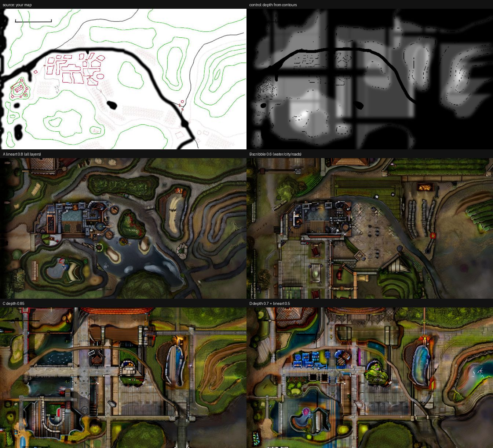

# Rendering a GM's own map with ControlNet (2026-09-18)

A GM supplied a 640x360 overland map: green contour rings for slopes, thick
dark lines for waterways, red blocks for city areas, grey lines for roads,
pink hatching for fields. The question was whether ControlNet could turn that
into a rendered map that keeps the GM's geometry.

It can. The layers do the work, and which control you pick decides how much
of the GM's intent survives.



## Pipeline

```
scripts/map-layers-to-controls.py --src <map> --out <dir>     # split by colour
cp <dir>/ctrl-lineart.png ~/.../ComfyUI/input/                # control image
node scripts/battlemap-render.mjs \
  --workflow workflows/battlemap/07-controlnet-region-map.api.json --out ./maps
```

The splitter writes three controls: `ctrl-lineart.png` (every drawn layer),
`ctrl-scribble.png` (structure only, contours dropped) and `ctrl-depth.png`
(height from the contour rings, water cut in).

## What the four passes showed

Same prompt, same seed, 1344x768, D&D Battlemaps SDXL at 14 steps:

| Pass | Control | Result |
| ---- | ------- | ------ |
| A | lineart 0.8, end 85% | **Best.** River where the GM drew it, contour rings as terraced slopes, the city block as a dense quarter in the right place |
| B | scribble 0.6 (contours dropped) | Buildings read better, but the valley is gone -- it invented a flat courtyard where the hills were |
| C | depth 0.85 | Elevation correct, but banding in the depth map hardened into walls: a compound, not a valley |
| D | depth 0.7 + lineart 0.5 | Inherited the banding, added colour noise. Worse than A alone |

Conclusions worth keeping:

- **The contour layer carries the terrain.** Dropping it (B) lost the valley.
- **Depth is the weak link, not the depth control.** The banding comes from
  counting contour crossings along straight rows and columns, which the map
  border and scale bar corrupt. A cleaner height map -- or a vector source
  with layers exported separately -- should let C and D beat A.
- **Scale mismatch stands.** The battlemap model renders at battlemap zoom,
  so a few-kilometre valley reads as an estate. Region maps want tiling, or
  a model that knows regional cartography.
- **Resolution matters.** 640x360 is below what a 1344x768 render wants;
  contours break up. Ask for the largest raster, or the vector.
